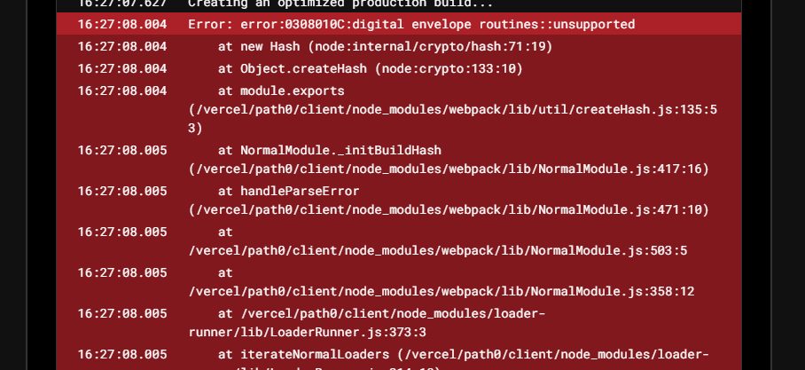
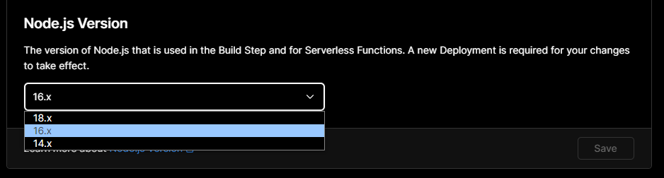
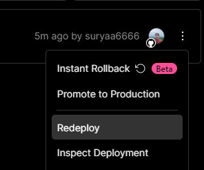
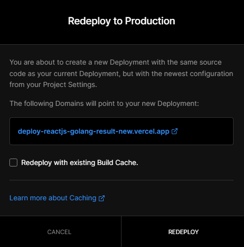

# Deploy backend to railway

`Railway` is a cloud platform as a service supporting several programming languages.

- Install postgres

  ```go
  go get -u gorm.io/driver/postgres
  ```

- Modify connection database with `env` and `postgres`

  > File: `pkg/mysql/mysql.go`

  - Import postgres package

    ```go
    "gorm.io/driver/postgres"
    ```

  - Get `host`, `user`, `password`, `database name`, and `port` from env

    ```go
    var DB_HOST = os.Getenv("DB_HOST")
    var DB_USER = os.Getenv("DB_USER")
    var DB_PASSWORD = os.Getenv("DB_PASSWORD")
    var DB_NAME = os.Getenv("DB_NAME")
    var DB_PORT = os.Getenv("DB_PORT")
    ```

  - Setup Database connection

    ```go
    dsn := fmt.Sprintf("host=%s user=%s password=%s dbname=%s port=%s", DB_HOST, DB_USER, DB_PASSWORD, DB_NAME, DB_PORT)
    DB, err = gorm.Open(postgres.Open(dsn), &gorm.Config{})
    ```

* Modify the server port from env

  > File: `main.go`

  ```go
  var port = os.Getenv("PORT");
  ```

* Make sure you modify `localhost` to just blank just like this :
  ```go
	fmt.Println("server running localhost:" + PORT)
	e.Logger.Fatal(e.Start(":" + PORT)) // delete localhost
  ```

* Go to Railway web : [Link]https://railway.app/) & Start a new project

* Sign up and verify first if you haven't already

* Create repository on github & push restAPI project

* On railway, Choose `New Project` → Search your repository & click `deploy now`

* Click your projects and click `Settings`, scroll down to and click `generate domain`, you will now have your own domain for backend

* On some space on board, right click and select database, and chosee `Add PostgreSQL`

* Click it, and select `Variables`, there is your database credentials, you can use it later.

* Okay, now go back to select your projects and choose `Variables`, drop all of your env key & value there, you can also use `RAW Editor`

  | VARIABLE        | VALUE                                                            |
  | --------------- | ---------------------------------------------------------------- |
  | PATH_FILE       | https://<yourbackenddomain.tld>/uploads/                         |
  | SECRET_KEY      | suryaganteng                                                     |
  | SERVER_KEY      | SB-Mid-server-fJxxxxxxxxxxxxxxxxxxx3                             |
  | CLIENT_KEY      | SB-Mid-client-YUxxxxxxxxxxxxxMS                                  |
  | EMAIL_SYSTEM    | suryaelidanto@gmail.com                                          |
  | PASSWORD_SYSTEM | rqxxxxxxxxxxxuu                                                  |
  | DB_HOST         | exx-xx-xx-xxx-xx.compute-1.amazonaws.com                         |
  | DB_NAME         | dboxxxxxxxb9e                                                    |
  | DB_PASSWORD     | bxxxxxxxxxxxxxxxxxxxxxxxxxxxxxxxxxxxxxxxxxxxxxxxxxxxxxxxxxxxxxxc |
  | DB_PORT         | xxxx                                                             |
  | DB_USER         | etxxxxxxxxxls                                                    |

# Deploy frontend to vercel

- First Modify `Midtrans Client Key` and config `baseUrl` from ENV

  - Midtrans Client Key

    > File: `src/pages/DetailProduct.js`

    ```javascript
    const myMidtransClientKey = process.env.REACT_APP_MIDTRANS_CLIENT_KEY;
    ```

  - Config `baseUrl`

    > File: `src/config/api.js`

    ```javascript
    {
        baseURL: process.env.REACT_APP_BASEURL,
    }
    ```

- Create repository & push frontend project

- Go to [Vercel](http://vercel.com) → Login → Click `Add New` -> `Project`

* Pick a your project repository, click `import`

* You can also choose your client folder in `root directory` (so you if you have 2 folder in one branch, you can select one, in example `client` folder)

* Now scroll down and click `Environment Variables`

* And add like this : 

  | VARIABLE                      | VALUE                            |
  | ----------------------------- | -------------------------------- |
  | REACT_APP_MIDTRANS_CLIENT_KEY | SB-Mid-client-YUxxxxxxxxxxxxxMS  |
  | REACT_APP_BASEURL             | https://<backend_domain>/api/v1/ |

- Click `Deploy`

- Wait deploy progress

- Oh no! it's error

  

- Don't worry, it's just because our projects use older node js version.

- First, you go to dashboard first and select your latest projects

- Go to settings, scroll down, and select node js version 16.

  

- And then Redeploy, just click Redeploy

  

  

- Click the link for open web

- Done :D
